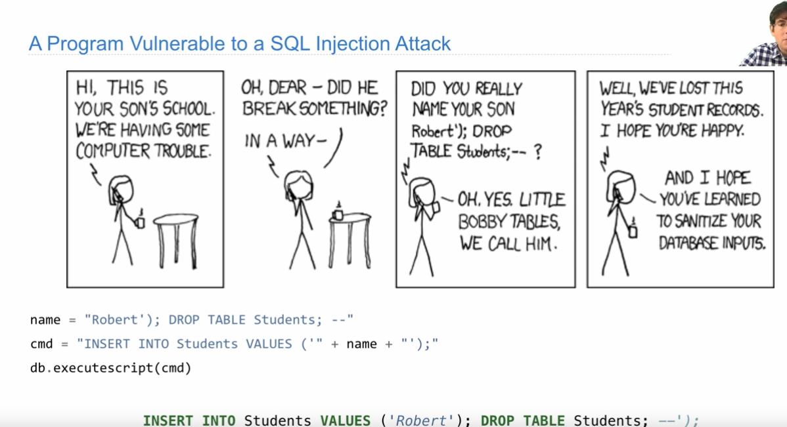

# CS 61A: Structure and Interpretation of Computer Programs

## Lecture 1

### What is Computer Science

- The study of: 

> - What problems can be solved using computation
> - How to solve those problems
> - What techniques lead to effective solution

- Areas that CS cover:

  > - Systems
  >
  > - Artificial Intelligence 
  >
  >   > - Decision Making
  >   >
  >   > - Robotics
  >   >
  >   > - Natural Language Processing
  >   >
  >   >   > - Translation
  >   >   > - Answering Questions 
  >   >   > - ...
  >   >
  >   > - ...
  >
  > - Graphics
  >
  > - Security
  >
  > - Networking
  >
  > - Programming Languages
  >
  > - Theory
  >
  > - Scientific Computing
  >
  > - ...

### What is This Course About

- A course about managing complexity

  > - Mastering abstraction
  > - Programming Paradigms
  > - Not all about 0's and 1's

- An introduction to Python

  > - Full understanding of language fundamentals
  > - Learning through implementation 
  > - How computers interpret programming languages

- A challenging course that will demand a lot.

### Expressions

- Evaluating expressions

  > Evaluate recursively


## Lecture 2

### Environment and Frame

- Execution rule for assignment statements

  > - Evaluate all expressions to the right of = from left to right
  > - Bind all names to the left of = to the resulting values in the current frame

- Execution procedure for def statements

  > - Create a function with signature <name>(<formal parameters>)
  > - Set the  body of that function to everything indented after the first line
  > - Bind <name> to that function in the current frame

- Procedure for calling/applying user-defined functions (v1):

  > - Add a local frame, forming a new environment
  > - Bind the functions' formal parameters to its arguments in that frame
  > - Execute the body of the function in that new environment
  >
  > > The signature of a function is important because it contains all information that is needed to create a local frame


### Looking Up Names in Environments

- An environment is a sequence of frames
- A name evaluates to the value bound to that name in the earliest frame of the current environment in which that name is found (这里的先后顺序为栈顺序)


## Lecture 3

```python
>>> print(print(1), print(2))
1
2
None
None
>>> None
>>> print(None)
None
```


### None Indicates that Nothing is Returned

- A function that does not explicitly return a value will return `None`
- `None` is not displayed by the interpreter as the value of an expression


### Pure Functions & Non-Pure Functions

- Pure Functions: just return values (e.g. abs(), pow())
- None-Pure Functions: have side effects (e.g. print())

回到上面的例子: 之所以会有这样的输出, 是因为先执行了 `print(1)` 和 `print(2)`


### Miscellaneous Python Features

```python
def div(n, d):
    """doctest
    >>> q, r = div(2013, 10)
    >>> q
    201
    >>> r
    3
    """
    return n // d, n % d
```

```bash
python -i filename.py // 交互模式运行
python -m doctest filename.py // 这是在命令行使用 doctest 的固定用法
```


### Conditional Statements

- Statement - Clause - Header - Suite


### Iteration

pass


## Lecture 4

### Higher-Order Functions

```python
assert expression, error message
```


### Purpose of Higher-Order Functions

Functions are first-class: Functions can be manipulated as values in our programming language.

Higher-order function: A function that takes a function as an argument value or returns a function as a return value.

Higher-order function:

- Express general methods of computation
- Remove repetition from programs
- Separate concerns among functions 


### Functional Abstraction


## Lecture 5

### Life Cycle of a User-Defined Function

**def statement**: A new function is created. Name bound to that function in the current frame.

**call expression**: Operator and operands evaluated. Function (value of operator) called on arguments (value of operands).


### Environments Enable Higher-Order Functions

高阶函数在返回目标函数后依旧保留它的 frame, 因为这是目标函数的 frame 的 parents.


### Local Names are not Visible to Other (Non-Nested) Functions


函数运行时的 parent frame 是他被定义的地方 (def), 因此这里 g(a) 中的 y 不会从 f(x, y) 中寻找, 因为它的 parent frame 是 global frame.


### Lambda VS Def

lambda 是匿名函数, 它的 frame 没有指定的名字, 而是通过标记定义的行数来区分函数. 


### Decorators

```python
@func1
def func2(...):
    ...
相当于

func1(func2)
```


## Lecture 6

### Recursive functions

`base cases` + `without recursive calls` + `with recursive calls`


### Converting Recursion to Iteration


### Order of Recursive Calls


## Lecture 7

### Tree Recursion


## Lecture 8

### Lists


### String

`exec(string)` 可以执行 `string` 所指代的代码


### Data Abstraction

> A methodology by which functions enforce an abstraction barrier between representation and use.   


### Abstraction Barrier


### Data  Representation

> Representation has nothing to do with the data itself.


### Dictionaries

- unordered
- key cannot be list or dictionary (or any other mutable type)
- two keys cannot be equal


### Examples


通过 `append` 添加的元素是引用. `extend` 是复制.


## Lecture 9

### Debugging

`assert statement, error message`:


### Testing: doctests

```python
def fib(n):
    """Fib
    >>> fib(2)
    1
    >>> fib(10)
    55
    """
    ...
```

To run doctest:

`python -m doctest file.py`


### Print Debugging

pass


### Interactive Debugging

**REPL**

`python -i file.py`

**PythonTutor**


### Error Types

- **SyntaxError**: 语法错误, 拼写错误
- **IndentationError**: 缩进错误
- **not callable**: 对错误的对象调用了 call
- **NoneType**: 使用了 `None` 对象或者函数没有返回值
- **NameError / UnboundLocalError**: 找不到对象


### Exceptions

`assert <expression>, <string>` 

关闭 `assert` 的方法:

- `python -O file.py`

- set `__debug__` to `False`


### Raise Statements

Exception are raised with a raise statement.

`raise <expression>`. `<expression>` must evaluate to a subclass of BaseException or an instance of one. Exceptions are constructed like any other object. E.g., `TypeError('Bad argument!')`

- TypeError
- NameError
- KeyError
- RuntimeError


### Try Statements

```python
try:
    <try suite>
except <exception class> as <name>:
    <except suite>
```


### Handling Exceptions

Exception handling can prevent a program from terminating

**Multiple try statement**: Control jumps to the except suite of the most recent try statement that handles that type of exception.


### Slicing


Slicing 是复制不是引用


### Processing Container Values

`max(iterables, key)`: key 是一个 func 或者 lambda, 它会在比较前作用于 values

`sum(iterables, initial)`

`all(iterables)`


### Trees


## Lecture 11

### Object

- Objects represent information 

- They consist of data and behavior, bundled together to create abstractions

- Objects can represent things, but also properties, interactions, & processes

- A type of object is called a class; classes are first-class values in Python

- Object-oriented programming:

  > - A metaphor for organizing large programs
  > - Special syntax that can improve the composition of programs

- In Python, every value is an object:

  > - All objects have attributes
  > - A lot of data manipulation happens through object methods
  > - Functions do one thing; Objects do many related things 


### String

- `upper()`

- `lower()`
- `swapcase()`: 大写变小写, 小写变大写
- `ord(str)`
- `hex(ord(str))`: 比如 `hex(ord(a))='0x41'`, 说明 a 在 ASCII 表的四行一列


### Unicode


### Mutation Operations

Only objects of mutable types can change: lists & dictionaries


### Tuples

Tuple 可以作为 dic 的 key, list 不行

Tuple 不能修改, 但是其中的可修改元素可以修改


### Sameness and Change

**Identity**: `<exp0> is <exp1>`. 判断二者是否指向同一个对象 (同一个地址)

**Equality**: `<exp0> == <exp1>`. 判断二者的值是否相同


### Mutable Default Arguments are Dangerous


函数的默认变量是 static 的


## Lecture 12

### Mutable Functions

- Local Assignment

- Non-Local Assignment & Persistent Local State

  > `nonlocal <name>`
  >
  > Effect: Future assignments to that name change its pre-existing binding in the first non-local frame of the current environment in which that name is bound.


### Referential Transparency, Lost

Expressions are referentially transparent if substituting an expression with its value does not change the meaning of a program.

- Mutation operations violate the condition of referential transparency because they do more than just return a value; they change the environment.

## Lecture 14

### Iterators

`iter(iterable)`: Return an iterator over the elements of an iterable value

`next(iterator)`: Return the next element in an iterator

`list(iterator)`: Convert all elements an iterator points to into a list


### Dictionary Iteration

> An **iterable** value is any value than can be passed to iter to produce am iterator
>
> An **iterator** is returned from iter and can be passed to next; all iterators are mutable

A dictionary, its keys, its values, and its items are all iterable values

- The order items in a dictionary in an arbitrary order (Python 3.5 and earlier)
- Now the order of items in a dictionary is the order in which they were added (Python 3.6+)
- When dictionary is changed (shape or structure of the dictionary, not values), the iterator becomes invalid


### For Statement

Iterator advances in for statement


### Built-in Functions for Iteration 

> Many built-in Python sequence operations return iterators that compute results lazily

**Examples:**

`map(func, iterable)`: Iterate over func(x) for x in iterable

`filter(func, iterable)`: Iterate over x in iterable if func(x) is true

`zip(first_iter, second_iter)`: Iterate over co-indexed (x, y) pairs

`reversed(sequence)`: Iterate over x in a sequence in reversed order

**To view the contents of an iterator, place the resulting elements into a container**

`list(iterable)`: Create a list containing all x in iterable

`tuple(iterable)`: Create a tuple containing all x in iterable

`sorted(iterable)`: Create a sorted list containing all x in iterable


### Generator and Generator Functions

> - A generator function is a function that yields values instead of returning them
>
> - A normal function returns once; a generator function can yield multiple times
>
> - A generator is an iterator created automatically by calling a generator function
>
> - When a generator function is called, it returns a generator that iterates over its yields

```python
def evens(start, end):
    even = start + start & 1
    while even <= end:
		yield even
        even += 2
```

Calling this functions above will return a generator .

`yield from iterable` = `for x in iterable: yield x `

```python
>>> list(countdown(5))
[5, 4, 3, 2, 1]

def countdown(k):
    if k > 0:
        yield k
        yield from countdown(k-1)
        
def prefix(s):
    if s:
        yield from prefix(s[:-1])
        yield s

# 这个函数非常妙
def substrings(s):
    if s:
		yield from prefix(s)
        yield from substrings(s[1:])

```

## Lecture 15

### Object-Orient Programming

> A method for organizing modular programs
>
> - A abstract barriers
> - Bundling together information and related behavior
>
> A metaphor for computation using distributed state
>
> - Each object has its own local state
> - Each object also knows how to manage its own local state, based on method calls.
> - Method calls are messages passed between objects.
> - Several objects may all be instances of a common type.
> - Different types may relate to each other.
>
> Specialized syntax & vocabulary to support this metaphor

### Classes

> A class serves as a template for its instances.

````python
class <name>:
    <suite>
````

Assignment & def statements in `<suite>` create attributes of the class (not names in frames)

类的一个特点是它的成员变量不是作为 frame 的变量创建的, 而是作为 class 的成员在 class 被创建的时候创建的.

### Object Construction

> When a class is called:
>
> - A new instance of the class is created
> - A default variable `self` is created
> - `__init__` method is called. It is called a **constructor**

### Methods

Methods are defined in the suite of a class statement. The functions are bounded as attributes of the class.

### Invoking Methods

All invoked methods have access to the object via the self parameter, and so they can all access and manipulate the object’s state.

`def deposit(self, amount)` 有两个参数, 但是在调用时只需填一个参数 `tom.deposit(100)`. 这是因为 `tom` 就是第一个参数 `self`.

### Dot Expression

Objects receive message via dot notation. Dot notation access attributes of the instance or its calss.

`<expression>.<name>`

- `<expression>` can be any valid Python expression
- `<name>` must be a simple name

### Attributes

`getattr(<calss name>, <att name>)`: return the value of attribute

`hasattr(<class name>, <att name>)`: return boolean indicating the existence of attribute

### Methods and Functions

> Object + Function = Bound Method

method 是指定 object 的 function

### Looking Up Attributes by Name

`<expression>.<name>`

1. Evaluate the expression
2. Name is matched against the instance of that object; if an attribute with that name exists, value is returned.
3. If not, name is looked up in the class, which yields a class attribute value.
4. That value is returned unless it is a function, in which case a bound method is returned instead.

### Class Attributes

Class attributes are “shared” across all instances of a class because they are attributes of the class, not the instance.

由于 suite 会在每次创建 instance 时被执行, 所以 suite 内指定的变量会存在于每个 instance 里, 但是它们在内存上不共用这一变量.

你可以将类理解为一个 frame, 而 instance 是创建于这个 frame 下的 subframe

## Lecture 16

class 和 instance 都有属于自己的 attribute. 通过 `<class name>.<name>` 修改 class 的 attribute 是全局的, 即所有 instance 的该 attribute 都改变.


#### Inheritance

Inheritance is a method relating classes together

A common use: Two similar classes differ in their degree of specialization

```python
class <name> (<base class>):
	<suite>
```

Conceptually, the new subclass “shares” attributes with its base class. The subclass may override certain inherited attributes. Using inheritance, we implement a subclass by specifying its differences from the base class.

```python
class CheckingAccount(Account):
    withdraw_fee = 1
    interest = 0.01
    def withdraw(self, amount):
        return Account.withdraw(self, amount + self.withdraw_fee)
```

观察上面的例子, 当我们从某个类继承时, 我们可以通过调用同名方法并传入 self 变量的方法来 override.

> **Base class attributes aren’t copied into subclass !**

To look up a name in a class:

1. if it names an attribute in the class, return the attribute value
2. Other wise, look up the name in the base class, if there is one

### Object-Oriented Designing

#### Design for Inheritance

Don’t repeat yourself; use existing implementations.

Attributes that have been overridden are still accessible via class objects.

#### Inheritance and Composition

Object-oriented programming shines when we adopt metaphor.

- Inheritance is best for representing  is-a relationships.

  E.g., a checking account is a specific type of account. CheckingAccount inherits from Account.

- Composition is best for representing has-a relationships.

  E.g., a bank has a collection of bank accounts it manages.

  So, A bank has a list of accounts as an attribute.

#### Multiple Inheritance

`class <class name>(base class1, base class2):`

#### Complicated Inheritance

## Lecture 17

### Linked List Structure

对于链表, 我一般会将最后一个元素的后驱设置为 None, 但是这里它推荐在 class 的定义里设置一个 Link.empty 用于标记链表结尾

```python
class Link:
    empty = () # empty = None
```

这个结尾标志物的值是什么并不重要 (当然要尽量不与链表中的元素重合), 只是在判断链表是否结束时将元素与标志物做对比.

### Property Methods

In some cases, we want the value of the attributes to be computed on demand.

The @property decorator on a method designates that it will be called whenever it is looked up on an instance. A `@<attribute>.setter`  decorator on a method designates that it will be called whenever that attribute is assigned. `<attribute>` must be an existing property method.

```python
@property
def second(self):
```
    >>> s.second
    4
    ```
    return self.rest.first

@second.setter
def second(self, value):
    ```
    >>> s.second = 2
    >>> s.rest.first
    2
    ```
    self.rest.first = 2
```

### Tree Class	

用 abstraction 的方式定义树

```python
class Tree:
    def __init__(self, label, branches = []):
        self.label = label
        for branch in branches:
            assert type(branch) == Tree
        self.branches = list(branches)
```

或者

```python
def tree(label, branches = []):
    for branch in branches:
        assert is_tree(branch)
    return [label] + list(branches)

def label(tree):
    return tree[0]

def branches(tree):
    return tree[1:]
```

### Measuring Efficiency

使用修饰器来计算某个函数被调用的次数

我第一次发现, **function 可以有自己的 attribute**. 

```python
def count(f):
    def counted(n):
		counted.call_count += 1
        return f(n)
   	counted.call_count = 0
    return counted

@count
def fib(n):
    pass
```

### Memorization

用修饰器实现记忆化搜索

```python
def memo(f):
	cache = {}
    def momorized(n):
		if n not in cache:
            cache[n] = f(n)
        return cache[n]
    return memorized
```

### Log 优化


## Lecture 18

### String Representations

`str`: legible to humans

`repr`: legible to Python interpreter

### The repr String for an Object

`repr(object) -> string`

For most object types, `eval(repr(object)) == object`

The result of calling repr on a value is what Python prints in an interactive session.

### The str String for an Object

The result of calling str on the value of an expression is what Python prints using the print function

### Polymorphic Functions

A function that applies to many (poly) different forms (morph) of data

`repr` invokes a `__repr__`  on its argument

`str` invokes a method `__str__` on its argument

### Implementing repr and str

The behavior of repr is slightly more complicated than invoking `__repr__` on its argument:

- An instance attribute called `__repr__` is ignored. Only class attributes are found

```python 
def repr(x):
    return type(x).__repr__(x)
# type(x) 指定 class
# __repr__(x) 指定 instance
```

The behavior of str is also complicated:

- An instance attribute called `__str__` is ignored
- If no `__str__` attribute is found, uses repr string

```python
def str(x):
    if hasattr(type(x), '__str__'):
        return type(x).__str__(x)
    else:
        return repr(x)
```

### Interfaces

**Message passing**: Objects interact by looking up attributes on each other (passing messages). The attribute look-up rules allow different data types to respond to the same message. A **shared message** (attribute name) that elicits similar behavior from different object classes is a powerful method of abstraction. An interface is a set of shared messages, along with a specification of what they mean.

### Special Method Names in Python

Certain names are special because they have built-in behavior. These names always and end with two underscores,.

- `__init__`: Invoked whenever constructed
- `__repr__`: Invoked to display an object as an Python expression
- `__add__`: Invoked to add one object to another
- `__bool__`: Convert to boolean value
- `__float__`: Convert to float value

### Modular Design

#### Separation of Concerns

A design principle: Isolate different parts of a program that address different concerns. A modular component can be developed and tested independently.

### Set Intersection

#### Linear-Time Intersection of Sorted Lists

双指针法

### Sets

`<set>.union()`: 并集

`<set>.intersection()`: 交集


## Lecture 19

### Scheme Fundamentals

- Primitive expressions: 2, 3.3, true, +, quotient, ...
- Combinations: (quotient 10 2), (not true), ...

Number are self-evaluating; symbols are bound to values

### Special Forms

A combination that is not a call expression:

- `if` expression: `(if <predicate> <consequent> <alternative>)`
- `and` and `or`: `(and <e1> ... <en>)`, `(or <e1> ... <en>)`
-  Binding symbols: `(define <symbol> <expression>)`
- New procedures: `(define (<symbol> <formal parameters>) <body>)`

### Lambda Expressions

Lambda expressions evaluate to anonymous procedures.

`(lambda (<formal-parameters>) <body>)`

### Scheme Lists

- `cons`: Two-argument procedure that creates a linked list
- `car`: Procedure that returns the first element of a list
- `cdr`: Procedure that returns the rest of a list
- `nil`: The empty list

### Symbolic Programming

` '<expression>`

### Programming Language

**Machine languages**: statements are interpreted by the hardware itself.

- A fixed set of instructions invoke operations implemented by the circuitry of the central processing unit (CPU).

- Operations refer to specific hardware memory addresses; no abstraction mechanisms.

**High-level languages**: statements & expressions are interpreted by another grogram or compiled (translated) into another language.

- Provide means of abstraction such as naming, function definition, and objects.
- Abstraction away system details to be independent of hardware and operating system.

### Metalinguistic Abstraction

A programming language has:

- Syntax: The legal statements and expressions in the language
- Semantics: The execution/evaluation rule for those statements and expressions

To create a new programming language, you either need a:

- Specification: A document describe the precise syntax and semantics of the language
- Canonical Implementation: An interpreter or compiler for the language

## Lecture 20

### Parsing

A parser takes text and returns expression.

### Recursive Syntactic Analysis

Predictive recursive descent parser inspects only k tokens to decide how to proceed, for some fixed k.

## Lecture 21

### Functional Programming

All functions are pure functions. No re-assignment and not mutable data types. Name-value bindings are permanent.

Advantages of functional programming:

- The value of an expression is independent of the order in which sub-expressions are evaluated.
- Sub-expressions can safely be evaluated in parallel or on demand.
- **Referential transparency**:  The value of an expression does not change when we substitute one of its subexpression with the value of thar subexpression.

### Recursion and Iteration in Python

In Python, recursive calls always create new active frames.

### Tail Recursion

#### Tail calls

A procedure call that has not yet returned is active. Some procedure calls are tail calls. A Scheme interpreter should support an unbounded number of active tail calls using only a constant amount of space.

A tail call is a call expression in a tail context:

- The last body sub-expression is a lambda expression
- Sub-expressions 2 & 3 in a tail context if expression
- All non-predicate sub-expressions in a tail context cond
- The last sub-expression in a tail context and or or
- The last sub-expression in a tail context begin

 简而言之, Tail calls 就是当函数在递归时, 如果某个 call 是这个函数中最后一次运算, 这就意味这层递归的参数不再被需要了, 因此可以丢弃以节省空间.

## Lecture 22

### Macros

- A macro is an  operation performed on the source code of a program before evaluation. Macros exist in many languages, but are easiest to define correctly in a language like Lisp. Scheme has a define-macro special form that defines a source code transformation.

Evaluating procedure of a macro call expression:

- Evaluate the operator sub-expression, which evaluates to a macro
- Call the macro procedure on the operand expressions without evaluating them first
- Evaluate the expression returned from the macro procedure

## Lecture 23

### Big Theta and Big O Notation for Orders of Growth

- Exponential growth: $\Theta(b^n)$
- Quadratic growth: $\Theta(n^2)$
- Linear growth: $\Theta(n)$
- Logarithmic growth: $\Theta(\log{n})$
- constant growth: $\Theta(1)$

Big O: upper bound

Big theta: lower bound

### Efficient Sequence Processing

#### Sequence Operations

`map`

`filter`

### Streams are lazy Scheme Lists

A stream is a list, but the rest of the list is computed only when needed.

Stream ranges are implicit

### Stream Processing


### Higher-Order Functions on Streams

### Stream of Primes

   素数筛

每次取一个元素, 同时从数列中去除所有它的倍数, 就可以得到素数数列

```Pyt
(define (sieve s)
	(cons-stream (car s)
		(sieve 
			(filter-stream
				(lambda (x) (not (= 0 (remainder x (car s)))))
				(cdr-stresm s)
			)
		)	
	)
)
```

### Lecture 24

### Database management systems (DBMS)

Structured Query Language (SQL)

### Declarative Programming

In **declarative language**

- A program is a description of the desired result
- The interpreter figures out how to generate the result

In  **imperative language**

- A program is a description of computational processes
- The interpreter carries out execution / evaluation rules

### SQL Overview

`select`: Creates a new table, either from scratch or by projecting a table

`create table`: Gives a global name to a table

#### Select Value Literals

`select [expression] as [name], [expression] as [name]...`

expression: column description 

name: column name

Selecting literals creates a one-row table, you can use union to combine tables (same number of columns)

`create table [name] as [select statements]`

`select [columns] from [table] where [condition] order by [order]`

###  Arithmetic in Select Expressions

列名可以代表对应的值

### Joining Two Tables

Two tables A & B are joined by a comma to yield all combinations of a row from A and a row from B

`[table A], [table B]` 会生成两个表的排列组合 

### Dot Expressions and Aliases

`[expression] as [name], [expression] as [name]`

`[name].[col name]`

### Numeral Expressions

Expressions can contain function calls and arithmetic operations

### String Expressions

`str || str`: combine operator

## Lecture 25

### Aggregate Functions

An aggregate function in the [columns] clause computes a value from a group of rows.

`min(colname)`

`max(colname)`

`count(*)`: Number of rows

`count(distinct colname)`: Count distinct elements

### Mixing Aggregate Functions and Single Values

当你使用 min, max 的时候, select 会自动选中 min, max 指向的值的行, 因此可以针对性的提取关于这一行的有关信息. 但是当有多个 min, max 时, 你会得到一个随机的返回值.

### Groups

`group by [colname]`: Group by unique value

`having [expression]`: Having 指向的是 group, 比如可以 `having count(*) > 1`

### Create Table


`UNIQUE`: 该列的值是不可重复的

`DEFAULT`: 当新的行被创建时, 未指定的行值为 DEFAULT value

### Drop Table


### Modifying Table


### Update


### Delete


### Python and SQL

`db = sqlite3.Connection(<filepath>)`

`db.execute("SQL expression")`

`“(?)”, element`: 可以自动填入命令语句的参数

`db.execute(...).fetcall()`: 可以捕捉输出

`db.commit()`: 执行该语句之前定义的的所有命令

### SQL Injection Attack



如何避免:

`db.execute("INSERT INTO Students VALUES (?)", [name])`

### Database Connections

